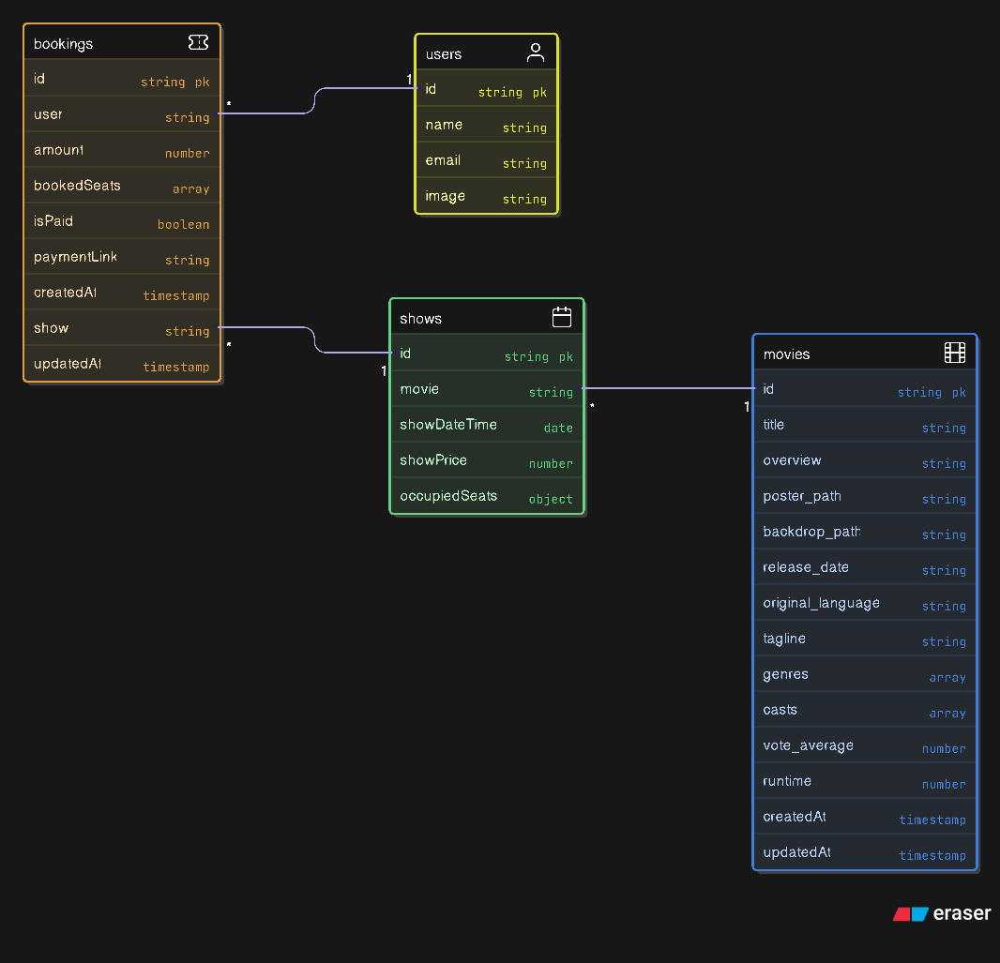

# Overview

This is a `Movie-Ticket-Booking` application, where user can book tickets for specific movie, with their desired seats.
The admin can set shows, view the booked seats also motior the earning of each movie.

This project is written with `React`. `TypeScript`, `Node`, `Express`, `MongoDB`. Along with the unit test using `Vitest` & `React-Testing-Library`.

This application provides feature like adding movies to favorites, booking seats without dealing with double bookings, reserving the booking seats for `10 minutes` if user fail to make payment.

It uses:

<table border>
  <thead>
    <tr>
      <th>Service</th>
      <th>Purpose</th>
    </tr>
  </thead>
  <tbody>
    <tr>
      <td>Clerk</td>
      <td>User authentication</td>
    </tr>
    <tr>
      <td>Inngest</td>
      <td>Triggering a function</td>
    </tr>
    <tr>
      <td>Stripe</td>
      <td>Payment integration</td>
    </tr>
    <tr>
      <td>Nodemailer</td>
      <td>Sending mails; SMTP</td>
    </tr>
  </tbody>
</table>


---

<strong>UML Diagram:</strong><br>



---

# Documenataion

# Frontend Documentation

This section of the project contains all the documentation you need to unders tand how the frontend is structured and how each part works including component, logic, routing, etc.

[](/client/README.md)


# Backend Documentation

This section conatins the dcumenation of all the things used in the creation of the backend service along with their need and use.

[](/server/README.md)


## Running the client

1. Go to the project directory

```
cd ".\client"
```

To be in the `client` repo.

2. Install dependencies

```
npm install
```

3. Run the application

```
npm run dev
```

This will run the application in `localhost:5173`.
If your port is already in use it will run at port `5174` but if you want to free it you need to get the process id for that process and kill that process. Use this in CMD.

---

### Terminate a Process

1. Find the process using specific port:

```
netstat -ano | findstr :5173
```

2. Terminate the process:

```
taskkill /PID 1245 /F
```

You will get a message that process is terminated, and to verify it again check which process is running at same port, if no output is there it means the process is successfully terminated.

---

#### Explanation:

1.  `netstat`:
    It shows all active network connections on your computer
    The output conatins:

        - Proto:

    Which shows the protocol used for the connection like TCP.

        - Local Address

    Your computer IP address and port number used for connection

        - Foreign Address

    The remote computer or server our computer connects to, along with the port number.

        - State

    It shows the staus of the connection, like "ESTABLISHED" when connection is active and data can be sent / received, "LISTENING" where a port on the computer is waiting for the incoming connections.

        `TCP [LOCAL_IP]:[LOCAL_PORT] [REMOTE_IP]:https ESTABLISHED`

2.  `netstat -a`:
    It shows all active connection and listening ports.
    Shows active TCP connections only.
    Provides: Protocol, Local Address, Foreign Address, State.

3.  `netstat -n`:
    It shows addresses and port number numerically.
    Shows connections numerically (IP addresses and port numbers) instead of resolving hostnames and services.
    Using "-n": ":https" -> ":443"

4.  `netstat -o`:
    Shows process ID (PID) of each process.

5.  `| findstr :5173`
    Filter the ouput to give the data only for port "5173".

6.  `taskkill`:
    Command to terminate a process.

7.  `/PID {PID}`:
    Specifies which process we want to kill.

8.  `/F`:
    Forces the process to terminate. Without `/F` the process might not terminate.

## Running the server

1. Go to the project directory

```
cd ".\server"
```

To be in the `server` repo.

2. Install dependencies

```
npm install
```

3. Run the application

```
node server.js
```

This will run the application in `localhost:3000`.
As that port is set by default.

---

<a href="https://greatstack.dev/p/quickshow" style="text-decoration:none;">
  
</a>

> This project was created from following the GreatStack tutorial.
