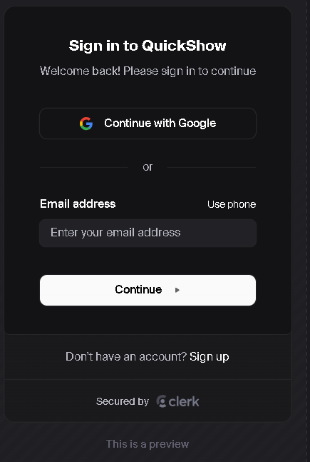
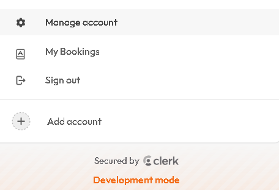

## Clerk

Clerk is used for user sign in / sign up, we can set what user can create account with like: "Email", "Phone number", etc.

Clerk Preview:<br>


---

Clerk Website: [Clerk Website](https://dashboard.clerk.com/)

With Clerk, we can login in using Google account along side navigating to other pages from with-in the profile handler with multi-account login.

``` js
<UserButton>
    <UserButton.MenuItems>
     <UserButton.Action
        label="My Bookings"
        onClick={() => navigate("/my-bookings")}
    />
    </UserButton.MenuItems>
</UserButton>
```

