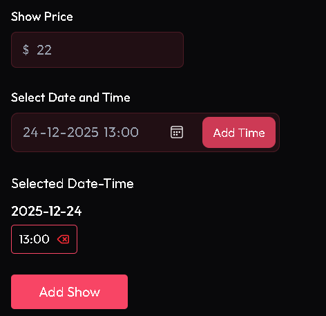

## Root Rendering

```ts
createRoot(document.getElementById("root")!).render(
  <StrictMode>
    <App />
  </StrictMode>
);
```

Here `document.getElementById('root')` has return type "HTMLElement | null". Meaning it could be null at runtime.

The `!` after an expression is called the `non-null assertion` operator.

It tells TypeScript: “I know this value will not be null or undefined, even if you think it might be.”

---

## StrictMode

React StrictMode intentionally double-invokes certain lifecycle functions in development (not in production) to help you detect unsafe code.

This includes:

1. useEffect (runs twice)
2. component mounting (mount → unmount → mount again)

---

## Dependencies

### Tailwind CSS

Installed Tailwind CSS using Vite:

[Tailwind CSS Vite Installation Guide](https://tailwindcss.com/docs/installation/using-vite)

---

### Outfit Google Font

Imported Outfit font from Google-Fonts:

[Google Fonts: Outfit & Poppins](https://fonts.googleapis.com/css2?family=Outfit:wght@100..900&family=Poppins:ital,wght@0,100;0,200;0,300;0,400;0,500;0,600;0,700;0,800;0,900;1,100;1,200;1,300;1,400;1,500;1,600;1,700;1,800;1,900&display=swap)

---

## Colors

Doing `bg-[###]` evrytime can cause bug, so a custom css property is used using `@theme`.

```css
@theme {
  --color-primary: #f84565;
  --color-secondary: #d63854;
}
```

Now it can be used as `bg-primary text-secondary`

## Testing

Tools used: `Vitest` + `React Testing Library`.

- Vitest:
  Vitest is a test runner and assertion libraray.
  A tool that runs your tests, checks expectations, and mocks modules.

- RTL:
  React Testing Library is a UI testing utility for React components.
  A library that helps you test React components, focusing on how users interact with them.

## Format Time

A simple lib function is created which take input as the minutes and return it in hour + minutes format, useful for showing movie runtime.

## React Player

Integrated `react-player`, which is a React component for embedding and playing video and audio in React application. It provides a consistent interface for various media sources, like YouTube, or local media files.

```js
<ReactPlayer url="..." />
```

## Fading Trailer

Using `group`, `group-parent` and `group-hover:not-hover`, the fading and highlighting is done for trailer section.

1. group:
   It is a Tailwind utility class, which we assign to parent and child can respond to `group-hover`

2. group-hover:
   The action we do for a particular element when parent is hovered.

Example:

```js
<div class="group">
  <p class="group-hover:text-red-500">Paragraph A</p>
  <p class="group-hover:text-blue-500">Paragraph B</p>
</div>
```

Here on hovering on `div` the para changes to their respective color.

To remove parent hover when we hover on an element use: `group-hover:not-hover` so that the parent hover is ignored on the hovered element.

```js
<div className="group">
  {dummyTrailers.map((trailer) => (
    <div key={trailer.image} className="group-hover:not-hover:opacity-50"></div>
  ))}
</div>
```

On hovering parent only and no child, every child get their `opacity-50`.
When a child if hovered we don't apply the `opacity-50` property.


## Showing Casts Horizontally

Using Tailwind CSS class of:

1. `overflow-x-auto`: We can scroll horizontally, it is usefull for showing casts, while staying at same viewport.
2. `scrollbar-width: none;`: This CSS property is used for hiding the scroll bar.


## Admin

Admin pages are implemented using nested routing + `<Outlet/>`, so we can change the middle UI part while keeping the same left side-bar for accesing multiple sections of Admin.

## Adding Shows

The admin can add shows using by storing the data in state variable, such that it can se used in HTTP request.

```js
const [selectedMovie, setSelectedMovie] = useState<number>(0);

const [dateTimeSelection, setDateTimeSelection] = useState<Record<string, string[]>>({});

const [dateTimeInput, setDateTimeInput] = useState("");

const [showPrice, setShowPrice] = useState("");
```

Admin cannot store same data as each record is in format:

```js
{
  "date1":["time1","time2"]
}
```

And using filter property we can remove redundancy.

Store the extracted value in a variable named \_, but we don’t plan to use it.

We only show the selected date section only if it has atleast 1 element, to do this we extract that date and return the remaining using desctructing previous state.

```js
_.value = prev[date];
const { [date]: _, ...rest } = prev;
```

```js
if (filteredTimes.length === 0) {
  const { [date]: _, ...rest } = prev;
  return rest;
} else {
  return {
    ...prev,
    [date]: filteredTimes,
  };
}
```


Showing the selcedt date-time section only when there is something in the state.



Using `group` and `group-hover:not-hover:{some-property}`.
We can make other movie cards dull and highlight the current movie.

It works by, when we add a `group` class to parent and `group-hover` to child, than on hvering parent every child `group-hover` is activated, but if we want only the current card should not be affected than we use `not-hover`, thus when we hover a current card, every other card get `{some-property}` from `group-hover:not-hover:{some-property}` except the current one.


