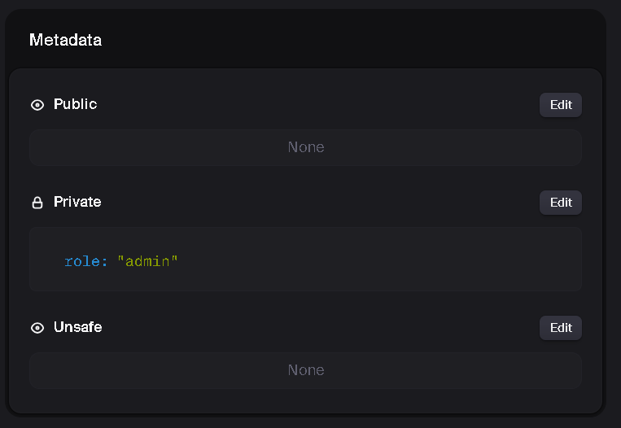

# Clerk User

Using the `user` section in the clerk website we can create any user, and assign their role to admin, using that we when user login with that credential they can access the `admin` section. 

Along side there are options whether clerk verify user using otp for email when login, we can disable the verification for testing purpose.

