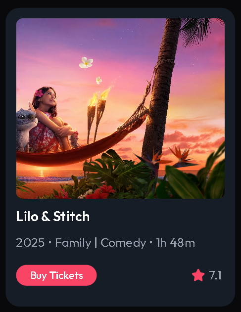
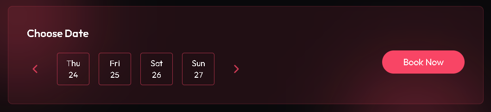
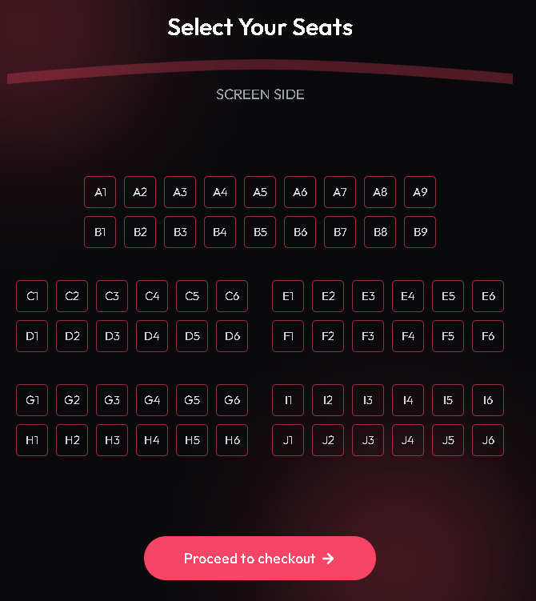

## NavBar + Footer

`NavBar` and `Footer` component is in all pages for user and not present for admin.

Used a `useState()` hook to open/close the NavBar for small screen. And based on the screen size as compared to ("md") we either get the NavBar for desktop or NavBar for small screen

## HeroSection

The backgound image is set using property

```css
.bg-image{
    background-image:url(./backgroundImage.png)
}
```

Other properties used were:
`background-size: cover`: Scales the image to completely fir the element
`background-position: center`: It controls where the image is placed in background

## Featured Section

This contains the movie cards with each card having:

1. Image
2. Title
3. Date, genre, run time
4. Buy ticket option and rating

The cards recieves the following props:
```js []
type MovieCardProps = {
  _id: string;
  title: string;
  backdrop_path: string;
  release_date: string;
  genres: { id: number; name: string }[];
  runtime: number;
  vote_average: number;
};
```

On clicking any card, user will be routed to that movie URL which is in format `"/movies/:id"`



## Blur Circle

A simple blur image is attached at the background using `z-index` to show a good visual, making this as a component which take props and based on that it align with their relative parent.

## Trailers

Trailers section conatins the `react-player` such that user can see any trailer without redirecting to another website, `react-player` allow us to view video from multiple sources.

User can view other trailers from list and can select any of them to play.

The trailer list has a CSS property where on hovering anyone trailer, all other trailer gets dull. 
This is achived by `group` and `group-hover`  class in Tailwind.

1. group:
It is a Tailwind utility class, which we assign to parent and child can respond to `group-hover`

2. group-hover:
The action we do for a particular element when parent is hovered.

``` js
<div class="group">
  <p class="group-hover:text-red-500">Paragraph A</p>
  <p class="group-hover:text-blue-500">Paragraph B</p>
</div>

```
Here on hovering on `div` the para changes to their respective color.

To remove parent hover when we hover on an element use: `group-hover:not-hover` so that the parent hover is ignored on the hovered element.


## Movie Details Page

Based on the params from the URL, `/movies/:id`, the `{id}` is captured and based on the id, the data is rendered. This component contains `Watch Trailer`, `Add to Favorite`, `Buying Ticket Option` with `Casts` and other movie deatails.


When user pick a date and books ticket, they are naviagted to seat-selection page for further process.
This making URL : `"/movies/:id/:date"`




## Seat Layout

The seat layout is designed with unqiue row + col, and its data is stored in the state for interaction with database.



## Admin Control

Admin dashboard can be formed using `<Outlet/>` and nested routing as all the endpoints starts from `"/admin"`