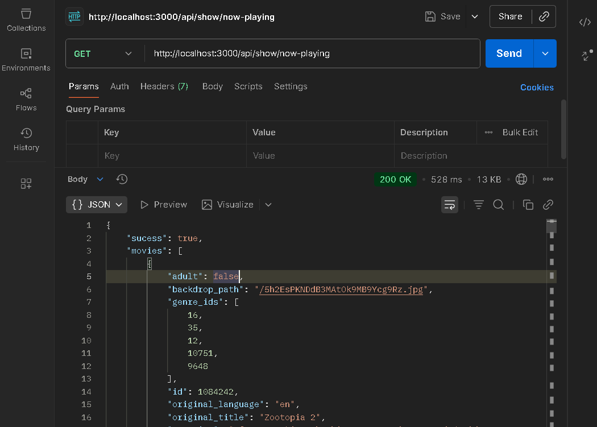
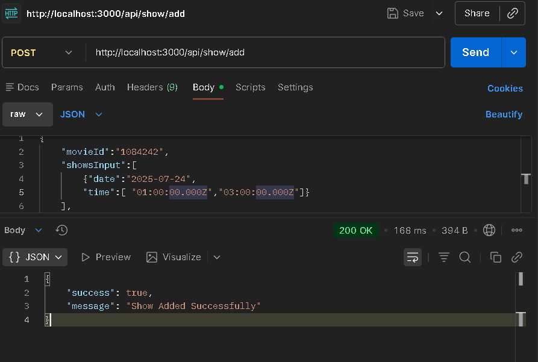
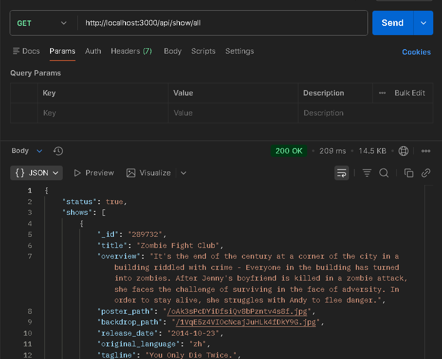
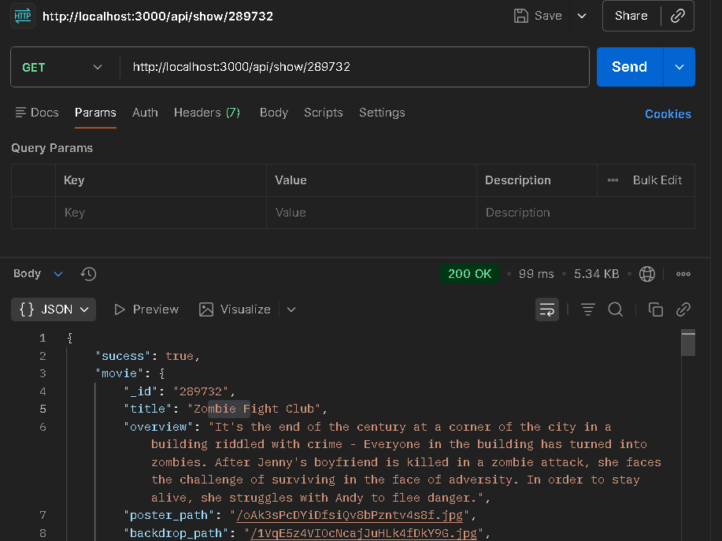

## TMDB API

We are fetching movie list from `TMDB` (The Movie Database) API, which needs a header to validate user key. The jey is generated after creating an account.

```js
const options = {
  method: 'GET',
  headers: {
    accept: 'application/json',
    Authorization: `Bearer ${Our KEY}`
  }
};
```

## API Testing

### Fetching Movies from TMDB API

When the clent send a rquest to `"/api/show/now-playing"`. The logic is divided into multiple segments like, we visit:<br>

- `server.js` and check is route is `/api/show` then it is routed to `showRouter` as this file conatins all routing for shows.
- Now inside `showRouter` we check the route `/now-playing'` and route the controller to `showContoller.js` where the function return a json showing the status `true / false` and return the data as `movies / error message` respectively.

Now we can test this endpoint using `Postman` by sending a GET reuest to `/api/show/now-playing`/



### Adding Shows

When Admin want to add a shows from the TMDB API to the application, admin will sent an HTTP request to the backend with:

```js
movieId, showPrice, showsInput;
```

And with this data we fetch a movie using movieId, and another API to fetch cast member using the same movieId and we save both the movie and shows in the database.

We use `promise.all` to fetch movie detail and cast members as both are on different endpoints.
`const [movieDetailsResponse, movieCreditsResponse] = await Promise.all([])`.

The endpoint for adding shows is `http://localhost:3000/api/show/add`, which on success add movie and shows.



### Display Shows to Users

When user visit the main page of the application they see the shows which came from the `Show` collection with unique movies.<br>
This data only depends on the `Show` collection, as we are only fetching the movie data from the `Show` which are unique are are scheduled to run in future, The shows are scheduled by admin.<br>
The endpoint for that is `http://localhost:3000/api/show/all`



### Individual Movies

When user click on any movie, they will get all the data of that movies like title, overview, casts, etc. We can fetch the data of individual movies using movie id which we get from query parameter, like `http://localhost:5173/movies/324544`.



## Seats Available

When user visits a show, they need to select the seats with time slot. So, here we will first see which seats are booked, and that came from the api call.
We will have 2 enpoints when user tries to book a show, which are: <br>

```js
// Endpoint to create booking while also checking seats availibility

http://localhost/api/booking/create

// Endpoint to update the booked seats

http://localhost/api/booking/seats/:showId
```

## Admin 