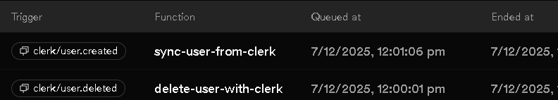

# Description

The user login / sign-in using clerk on frontend, but we need to store same user data in the backend, using clerk itself.

The other option is to make an account section, which store data in state, and send it to the backend where we save each data in the database, but here the complexity of password encryption cames. So, using clerk we can save the user credential in both frontend & backend

We set-up clerk in backend using:

```js
CLERK_PUBLISHABLE_KEY = key;
CLERK_SECRET_KEY = key;
```

### Clerk now provides 2 middleware.<br>

<strong>clerkMiddleware()</strong><br>
Checks if user is logged in & attaches user info to request. Add the user's info to `req.auth`.
<br>Does NOT block anyone — even guests can access routes; logged-in users just get their info attached.

```css
req.auth.userId;
req.auth.sessionId;
req.auth.actor;
```

<strong>requireAuth()</strong><br>
Blocks access unless user is logged in. <br>
Blocks anyone not logged in, returns 401 if no valid session

``` js
// Use `getAuth()` to get the user's `userId`
  const { userId } = getAuth(req)
```

```js
app.use(clerkMiddleware());

app.get("/private", requireAuth(), (req, res) => {
  // Only logged-in users can access
  // req.auth.userId is guaranteed to exist
});
```

## Clerk Webhook

A webhook is like a notification from a server.
Clerk sends an HTTP request when something happens in our application.

## Inngest

Inngest is a serverless system that react to certain events. Like on new user sign-in clerk sents notificationa or events and inngest perform action like running a function.

## Clerk + Inngest

Even if user log-in on the frontend, the backend still needs clerk for authentication and user data verification. Frontend proves user is logged-in and clerk on backend validates it.

Inngest react to events asynchronously.<br>

``` js
Clerk triggers a webhook → Inngest receives it → runs the workflow (send email, update DB, etc.)
```

<strong>Working:</strong>

User sign-in on frontend<br>
Backend receives request, clerk validates it<br>
User is created, clerk webhook is triggered<br>
Inngest recives the webhook and runs a workflow<br>

## Setup

First get the required keys from Inngest website

``` js
INNGEST_EVENT_KEY = key
INNGEST_SIGNING_KEY = key
```

On `Configure` section in CLerk set `Endpoint` to Inngest

Our goal it to store user data on the "User" model in the database, but since user is logged-in via Clerk. When user is created we trigger an event an Inngest will get data of user from clerk and save those data in the "User" model.

Here, we don't have write login in server for CRUD operation in user, we onky need to provide the inngest function.

``` js
const syncUserDeletion = inngest.createFunction(
    {id:"delete-user-with-clerk"},
    {event:"clerk/user.deleted"},
    async ({event})=>{
        const {
            id
        } = event.data
        await User.findByIdAndDelete(id);
    }
)
export const functions = [syncUserDeletion];
```

This will automaticaly execute the code when `clerk/user.deleted` event occurs.
And same is updated in database.


