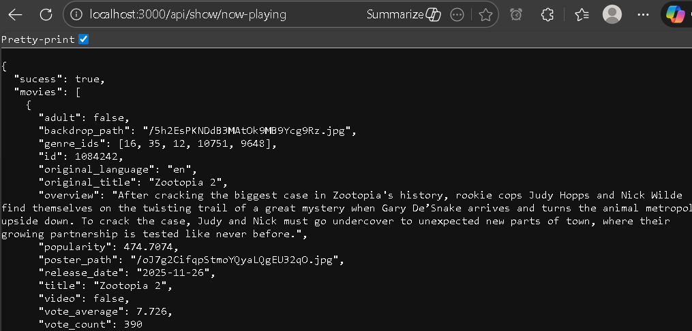

#

The main server file will get messy if we add evry routes and middlewares. So we route or redirect to multiple files based on main route.<br>
Like is we put all route in `server.js` we would have:
```js
app.get("/movies", getMovies);
app.post("/movies", addMovie);
app.delete("/movies/:id", deleteMovie);
```
So we redirect based on main routes like movies, or user.<br>
Example: If all request is for movies or user, we simple redirect to simple main routes:
```js
app.use("/movies", movieRoutes);
app.use("/users", userRoutes);
```

And inside each one we can write every possibilites like GET, POST methods with out writing all in main file.
```js
router = express.Router()
router.get("/", getMovies);
router.post("/", addMovie);
router.delete("/:id", deleteMovie);
```

To check the data aviable in a working route we can directly go to that URL, and see the response.

